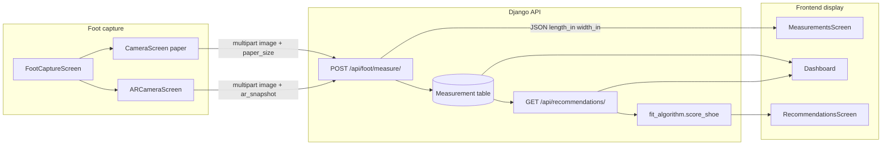

# Frontend Features — Code Map & Data Flow

Where the major frontend features live, which lines implement them, and how data moves between the app, local storage, and the backend.

> **Line numbers** refer to the codebase at the time this doc was written. They may shift slightly as files change — search for the symbol or comment label if a range no longer matches.

---

## Table of Contents

1. [End-to-end overview](#1-end-to-end-overview)
2. [Authentication](#2-authentication)
3. [Foot photo → backend measurement → database](#3-foot-photo--backend-measurement--database)
4. [Measurements → recommendations algorithm](#4-measurements--recommendations-algorithm)
5. [Device tilt & sensors (accelerometer, not gyroscope)](#5-device-tilt--sensors-accelerometer-not-gyroscope)
6. [Fit score color swatches](#6-fit-score-color-swatches)
7. [Recommendation filters (client-side)](#7-recommendation-filters-client-side)
8. [Wishlist & closet (local only)](#8-wishlist--closet-local-only)
9. [Fit feedback (UI only today)](#9-fit-feedback-ui-only-today)
10. [What persists where](#10-what-persists-where)

---

## 1. End-to-end overview

---

## 2. Authentication

| What | File | Lines | What it does |
|------|------|-------|--------------|
| Google sign-in UI | `screens/LoginScreen.js` | 6–22 | Calls auth service, saves token, navigates to main app |
| Native Google + token exchange | `services/auth.js` | 11–47 | `googleSignIn()` → ID token; `signInWithGoogle()` → POST `/api/auth/google/` → DRF `key` |
| Token storage | `screens/LoginScreen.js` | 15 | `SecureStore.setItemAsync('authToken', token)` |
| Auth gate on launch | `App.js` | 227–231 | Reads token; `MainTabs` if present, else `Welcome` |
| API base URL | `config/api.js` | 1–5 | `API_BASE_URL` from env or emulator-friendly default |

**Database:** Backend creates/looks up `User` and returns a DRF authtoken. The token is **not** in the SQL database from the app's perspective — it lives in SecureStore on device.

---

## 3. Foot photo → backend measurement → database

### 3.1 Entry points

| What | File | Lines | What it does |
|------|------|-------|--------------|
| Method chooser | `screens/FootCaptureScreen.js` | 39–88 | AR primary; paper secondary; gallery pick |
| Dashboard CTA | `screens/Dashboard.js` | 216–223 | **Update Measurements** → `navigation.navigate('FootCapture')` |
| Navigation routes | `App.js` | 98–137, 272–311 | Registers capture screens on Closet stack + root stack |

### 3.2 Paper method upload

| Step | File | Lines | What it does |
|------|------|-------|--------------|
| Take photo | `screens/CameraScreen.js` | 101–111 | `cameraRef.takePictureAsync` → `preview` phase |
| Build FormData | `screens/CameraScreen.js` | 118–123 | Appends `image` file + `paper_size` (`letter` / `a4`) |
| POST to API | `screens/CameraScreen.js` | 125–130 | `POST ${API_BASE_URL}/api/foot/measure/` with `Authorization: Token …` |
| Navigate with result | `screens/CameraScreen.js` | 132–138 | `navigation.navigate('Measurements', { measurements: data })` |
| Show results | `screens/MeasurementsScreen.js` | 13–64 | Reads `route.params.measurements`; `getBestSize` / `getSizeRange` from `utils/shoeSize.js` |

### 3.3 AR method upload

| Step | File | Lines | What it does |
|------|------|-------|--------------|
| AR snapshot capture | `screens/ARCameraScreen.js` | 145–170 | Native `ARCoreModule.captureSnapshot()` |
| FormData + AR metadata | `screens/ARCameraScreen.js` | 181–194 | `measurement_method: arcore` + `ar_snapshot` JSON |
| POST to API | `screens/ARCameraScreen.js` | 196–208 | Same endpoint as paper; navigates to Measurements on success |

### 3.4 Backend (for context — not frontend code)

| Step | File | Lines | What it does |
|------|------|-------|--------------|
| Receive upload | `backend/api/views.py` | `FootMeasureView.post` 187–229 | Validates image; branches `paper` vs `arcore` |
| Paper: Roboflow + PPI | `backend/api/views.py` | `_measure_with_paper` 231–329 | Detects paper + foot; computes inches |
| **Save to DB** | `backend/api/views.py` | 306–317 | `Measurement.objects.create(...)` — `length_in`, `width_in`, `area_sq_in`, toebox, method |
| AR: unproject + save | `backend/api/views.py` | `_measure_with_ar` 331+ | Roboflow polygons + AR math → same `Measurement` model |
| Response JSON | `backend/api/views.py` | 319–329 | Returns dimensions to app (image not stored; `image_url=""`) |

The frontend **does not** write measurements to AsyncStorage. After capture, values are shown from the POST response; later screens re-fetch via `GET /api/measurements/latest/`.

---

## 4. Measurements → recommendations algorithm

The **scoring algorithm runs entirely on the backend**. The frontend only triggers it by calling the recommendations endpoint after a measurement exists.

### 4.1 Frontend fetch

| What | File | Lines | What it does |
|------|------|-------|--------------|
| Recommendations tab load | `screens/RecommendationsScreen.js` | 92–122 | `useFocusEffect` → GET `/api/recommendations/` |
| Dashboard preview | `screens/Dashboard.js` | 128–148 | Same endpoint for horizontal carousel |
| 404 = no scan | `screens/RecommendationsScreen.js` | 108 | Sets `noMeasurement` empty state |
| Display fit fields | `screens/RecommendationsScreen.js` | 274–347 | Renders `fit_score`, `fit_status`, `fit_status_label`, `recommended_size` from API |
| Hide rejected | `screens/RecommendationsScreen.js` | 165 | Client filter: `fit_status === 'REJECTED'` removed from list |

### 4.2 Backend algorithm (for context)

| Step | File | Lines | What it does |
|------|------|-------|--------------|
| Load latest measurement | `backend/api/views.py` | `RecommendationsView.get` 540–550 | Latest `Measurement` for user; 404 if none |
| Build foot dict | `backend/api/views.py` | 560–566 | `length_in`, `width_in`, `area_sq_in`, toebox fields |
| Score each shoe | `backend/api/views.py` | 572–615+ | `score_shoe(foot, shoe_data, sub_type)` in `backend/services/fit_algorithm.py` |
| Return ranked list | `backend/api/views.py` | (serializer) | Each result includes `fit_score`, `fit_status`, tags, images, price |

Optional query param `?sub_type=` is supported by the API (`views.py` 568) but **not** sent by the current frontend — filters are applied client-side instead (see §7).

### 4.3 Display-only size helpers

| What | File | Lines | What it does |
|------|------|-------|--------------|
| US size from length | `utils/shoeSize.js` | 30–55 | `getBestSize`, `getSizeRange` — Brannock formula for UI labels |
| Dashboard typical size | `screens/Dashboard.js` | 209–212 | `getBestSize(measurements.length_in)` on foot profile card |

---

## 5. Device tilt & sensors (accelerometer, not gyroscope)

The app uses the **accelerometer** (gravity vector) to estimate phone tilt. There is **no gyroscope** API usage in the frontend.

### 5.1 Paper camera (`CameraScreen.js`)

| What | Lines | What it does |
|------|-------|--------------|
| Constants | 27–28 | `TILT_OK_DEGREES = 10`, `LIGHT_MIN_LUX = 50` |
| Accelerometer listener | 49–68 | Every 200 ms: angle from `(x,y,z)` → `isAligned` if ≤ 10° |
| Light sensor (Android) | 70–99 | `LightSensor` illuminance; warns if &lt; 50 lux |
| **Color swatches (live status)** | 193–210 | Green `#2E7D32` aligned / red `#B33` tilted; pink `#FFCDD2` dark / green `#C8E6C9` OK light |
| Capture gate | 210 | `canCapture = isAligned` — blocks shutter when tilted |

### 5.2 AR camera (`ARCameraScreen.js`)

| What | Lines | What it does |
|------|-------|--------------|
| Accelerometer | 106–120 | Same tilt math as paper camera |
| Floor plane poll | 125–140 | `ARCoreModule.queryTrackingState()` every 500 ms |
| **Color swatches (live status)** | 302–306, 329–334 | Tilt green/red; floor amber `#B8860B` scanning → green `#2E7D32` detected |
| Capture gate | 308 | `canCapture = isAligned && floorDetected` |

---

## 6. Fit score color swatches

These map backend `fit_status` strings to badge colors on shoe cards.

### 6.1 Status → hex map (duplicated in three screens)

| Status | Color | Meaning |
|--------|-------|---------|
| `PERFECT` | `#2E7D32` | Best fit |
| `GOOD` | `#558B2F` | Strong fit |
| `ACCEPTABLE` | `#F57F17` | OK fit |
| `MARGINAL` | `#E64A19` | Borderline |
| `POOR` | `#B71C1C` | Poor fit |
| `REJECTED` | `#9E9E9E` | Hidden from recommendations list |

| File | Constant lines | Applied at (badge render) |
|------|----------------|---------------------------|
| `screens/RecommendationsScreen.js` | 40–47 | ~277, 341–345 |
| `screens/Wishlist.js` | 15–22 | ~68, 117–121 |
| `screens/Closet.js` | 14–21 | ~50, 94–98 |

Badge styling pattern: `backgroundColor: statusColor + '20'` (20% alpha) + `borderColor: statusColor`.

### 6.2 Welcome carousel icon backgrounds (marketing swatches)

| File | Lines | What it does |
|------|-------|--------------|
| `screens/WelcomeScreen.js` | 16–40 | `FEATURES[].iconBg` — `#D3E2F2`, `#D4E3C4`, `#E5D4FF` per step |
| `screens/WelcomeScreen.js` | 97 | Applied: `{ backgroundColor: feature.iconBg }` on step icon circle |

### 6.3 Brand / UI palette

Documented in [`FRONTEND_STYLE_GUIDE.md`](./FRONTEND_STYLE_GUIDE.md). Primary accent `#C28A5B` used in `App.js` tab bar (182–183), buttons across screens.

---

## 7. Recommendation filters (client-side)

Filters do **not** change the API request. The app fetches the full scored list once, then filters in memory.

| What | File | Lines | What it does |
|------|------|-------|--------------|
| Filter attribute definitions | `constants/attributes.js` | 1–7 | `ATTRIBUTE_FILTERS` keys match `attributes_json` on each shoe |
| Category maps | `screens/RecommendationsScreen.js` | 18–37 | `FUNCTION_CATEGORIES`, `SILHOUETTE_CATEGORIES` |
| Fetch all results | `screens/RecommendationsScreen.js` | 92–122 | Single GET; stores in `allResults` |
| Client filter logic | `screens/RecommendationsScreen.js` | 162–181 | Tags + `attributes_json`; excludes saved/owned/rejected |
| Filter drawer UI | `screens/RecommendationsScreen.js` | 127–160, 463–545 | Draft state → **Apply filters** commits |
| Active filter badge | `screens/RecommendationsScreen.js` | 154–156, 576–579 | Orange dot on header icon |

---

## 8. Wishlist & closet (local only)

Saved and owned shoes are **not** written to the backend `UserCollection` table today.

| What | File | Lines | What it does |
|------|------|-------|--------------|
| Wishlist state | `SavedShoesContext.js` | 8–44 | `toggleSaved` / `isSaved`; AsyncStorage key `savedShoes` |
| Closet state | `OwnedShoesContext.js` | 8–43 | `toggleOwned` / `isOwned`; AsyncStorage key `ownedShoes` |
| Providers wired | `App.js` | 244–323 | `OwnedShoesProvider` → `SavedShoesProvider` wraps navigation |
| Heart on recommendations | `screens/RecommendationsScreen.js` | 297–303 | `toggleSaved(item)` + toast |
| Bag on recommendations | `screens/RecommendationsScreen.js` | 312–321 | `toggleOwned`; removes from wishlist if hearted |
| Wishlist → closet move | `screens/Wishlist.js` | 87–100 | Sets `returnToWishlistOnRemove: true` |
| Closet → wishlist restore | `screens/Closet.js` | 69–79 | On un-own, restores if flag set |
| Hide from recommendations | `screens/RecommendationsScreen.js` | 166–167 | `isSaved` / `isOwned` filter |

---

## 9. Fit feedback (UI only today)

### 9.1 What the frontend does now

| What | File | Lines | What it does |
|------|------|-------|--------------|
| Open from owned shoe | `screens/Closet.js` | 114–119 | `navigation.navigate('Feedback', { shoe: item })` |
| Slider UI | `screens/feedback.js` | 37–85 | `FitSlider` — length/width −5…+5 via touch |
| Submit handler | `screens/feedback.js` | 116–123 | Sets local state + toast; **no `fetch`** |
| Auto back | `screens/feedback.js` | 120–122 | `navigation.goBack()` after 900 ms |

### 9.2 Backend algorithm (exists, not wired from app)

The backend has infrastructure to **learn tolerance bands** from user feedback, but there is **no feedback POST endpoint** in `backend/api/urls.py` yet.

| Component | File | Purpose |
|-----------|------|---------|
| `UserFeedback` model | `backend/migrations/0005_userfeedback.py` | Stores feedback rows |
| Feedback ingestion | `backend/services/feedback_service.py` | `get_feedback_rows()` |
| Tolerance learning | `backend/services/tolerance_learning.py` | Adjusts bands from feedback |
| Retrain job | `backend/tasks/retrain.py` | Batch update tolerances |
| Used in scoring | `backend/api/views.py` | ~557 — toebox uncertainty via profile tolerance bands |

**When wired:** the app would POST slider values → `UserFeedback` table → periodic retrain → `score_shoe()` uses updated tolerances → different `fit_score` / `fit_status` on next `GET /api/recommendations/`.

---

## 10. What persists where

| Data | Frontend storage | Backend / DB |
|------|------------------|--------------|
| Auth token | SecureStore `authToken` | DRF `authtoken_token` table |
| Foot measurements | Not cached locally | `Measurement` row per scan |
| Recommendations | In-memory per screen focus | Computed on each GET from `Measurement` + `Shoe` |
| Wishlist | AsyncStorage `savedShoes` | Not synced |
| Owned shoes | AsyncStorage `ownedShoes` | Not synced |
| Fit feedback sliders | Not persisted | Model exists; no API wired |
| Profile display name | Not cached | `Profile` table via PATCH `/api/profile/` |

---

## Related docs

- [FRONTEND_STYLE_GUIDE.md](./FRONTEND_STYLE_GUIDE.md) — conventions and palette
- [FRONTEND_TESTING.md](./FRONTEND_TESTING.md) — manual QA cases
- [docs/FRONTEND.md](../../docs/FRONTEND.md) — architecture deep dive
- [docs/COMPUTER_VISION.md](../../docs/COMPUTER_VISION.md) — Roboflow + fit scoring math
